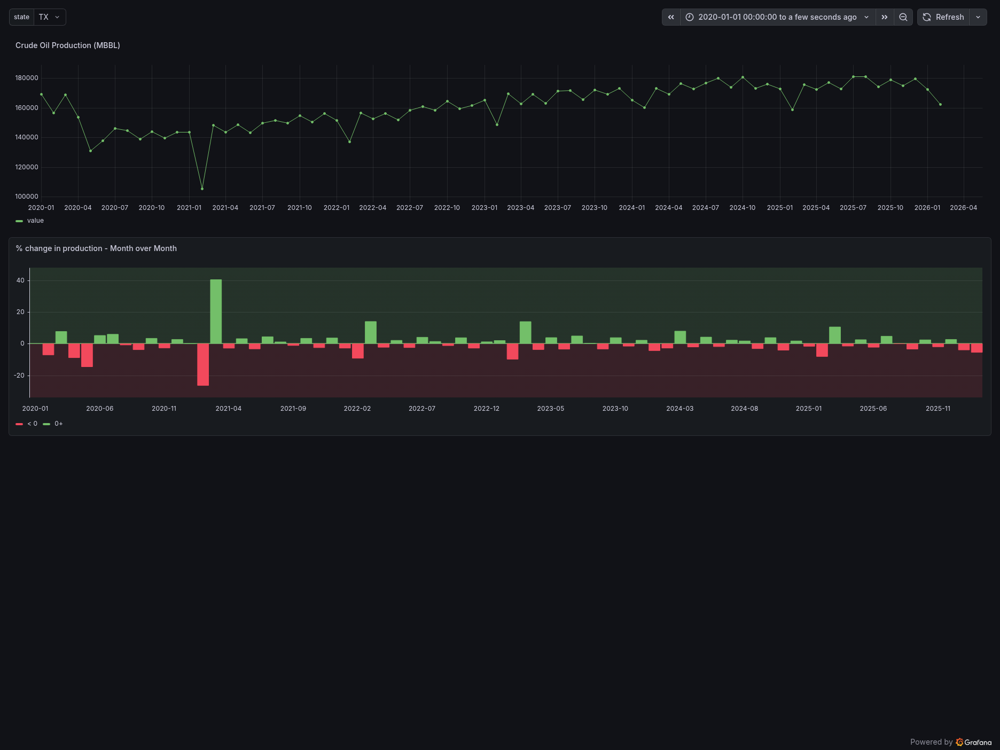
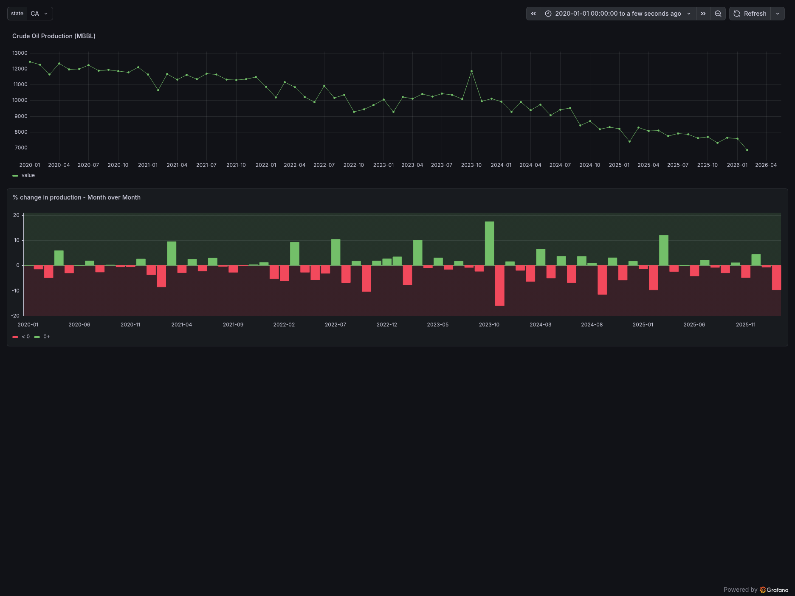
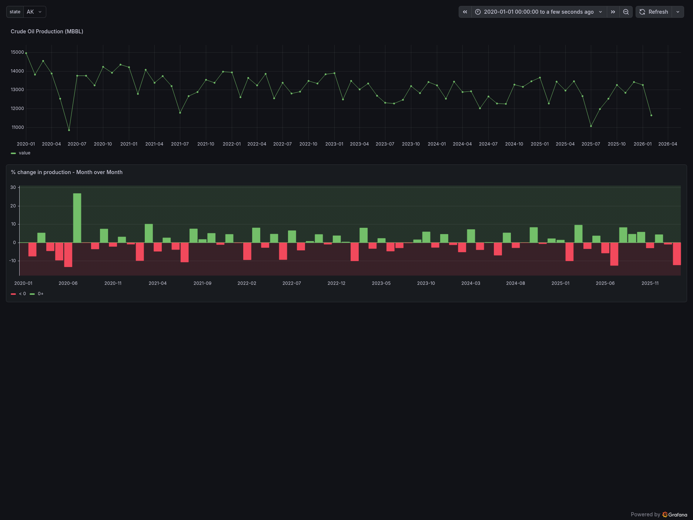

# EIAPipelineProject

### Function: pulls data from EIA API for Crude Oil Production for 2024(can be changed). Cleans the data to only contain the necessary columns, updates datatypes and uploads it to S3 as a parquet file with a partitioned structure that can be queried by Athena without extra work 

### Structure: 
```
┌─────────────┐    ┌──────────────┐    ┌─────────────────┐    ┌──────────────┐
│  EIA API v2 │───▶│   Extract    │───▶│  Transform/Load │───▶│  S3 (Parquet)│
│  (REST/JSON)│    │  (requests)  │    │ (pandas/pyarrow)│    │  partitioned │
└─────────────┘    └──────────────┘    └─────────────────┘    └──────────────┘
                                                │
                                                ▼
                                       ┌──────────────┐
                                       │  Metadata DB │
                                       │   (SQLite)   │
                                       └──────────────┘
```
### Stack: Python(dependencies:pandas, pyarrow, boto3, requests, python-dotenv, sqlite3), S3, SQLite

### File function: 
- eia_client makes the api request and returns it to main.py so it can be converted to a dataframe
- transform cleans and transforms the data, returns a dataframe that can then be uploaded by loader
- loader loads it into S3 after converting the dataframe to a parquet file that is also stored locally. Returns S3 upload path so it can be saved in metadata
- metadata creates a table for metadata if none exists, and uploads information about each run including error logging 

### Design choices: 
- Parquet was chosen over CSV due to its speed, columnar data in parquet will allow data to be queried without needing to read each and every entry. 
- I partitioned my S3 layout into month, year, and state because the query tool AWS Athena can read the folder structure outright, ignoring anything that doesn't match. This should also help with speed since it will read only the files it needs to
- I decided to log metadata partially in case i want to use it for future triggers for each step, and partially for error logging, so I can find the part of the pipeline with the error and investigate if need be

### Dashboard Link (Texas data only due to Grafana constraints): 
#### https://mdaredia28.grafana.net/public-dashboards/fe7dff75175d462997ba7b045663cf24  





